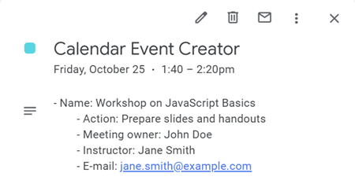

# 📅 Calendar Event Creator

This script **automates** the creation of Google Calendar events based on data retrieved from a Google Spreadsheet. It is designed to scan a specific sheet, identify rows based on a "support" (`Support`) column, and create events in a designated Google Calendar.

---
## 📚 Table of Contents

- [✨ Features](#-features)
- [📋 Prerequisites](#-prerequisites)
- [📊 Spreadsheet Structure](#-spreadsheet-structure)
- [📊 Sample Spreadsheet Table](#-sample-spreadsheet-table)
- [⚙️ How It Works](#-how-it-works)
- [🛠️ Configuration](#-configuration)
- [🚀 How to Run the Script](#-how-to-run-the-script)
- [💡 Example of a Generated Event](#-example-of-a-generated-event)
- [📝 Logging](#-logging)
- [🔧 Customization](#-customization)
- [⚠️ Limitations](#-limitations)
- [🔐 Security Policy](#-security-policy)
- [🐞 Issue Reporting and Feature Requests](#-issue-reporting-and-feature-requests)
- [📄 License](#-license)
---

## ✨ Features

- Reads data from a Google Spreadsheet.
- Automatically creates events in a Google Calendar.
- Prevents duplicate events by checking existing events in the time range.
- Adds event details (event owner, instructor, metadata) to the event description.
- Includes a pop-up reminder for the created events.

---

## 📋 Prerequisites

1. **Google Calendar and Spreadsheet Access**  
   Ensure you have the required access to both the Google Calendar and the Spreadsheet.

2. **Google Apps Script Permissions**  
   This script requires permissions to access and manage your Google Calendar and Sheets.

---

## 📊 Spreadsheet Structure

The Google Spreadsheet must have the following columns with specific headers:

- **Name**: Event Name
- **Time**: Event Time (e.g., `09:00 - 10:00`)
- **Date**: Event Date (in `dd.MM.yyyy` format)
- **Action**: Action or task description
- **Owner**: Event owner
- **Instructor**: Instructor
- **E-mail**: Email account responsible for the event
- **Support**: Support identifier, which is compared to `targetName`

---

## 📊 Sample Spreadsheet Table

Below is an example of how the data should be structured in your Google Spreadsheet:

| Name                          | Time            | Date         | Action                   | Owner | Instructor    | E-mail                     | Support       |
|--------------------------------|----------------|-------------|-----------------------------|-----------------|--------------|---------------------------|------------|
| Workshop on JavaScript Basics   | 14:00 - 14:40  | 25.10.2024  | Prepare slides and handouts | John Doe        | Jane Smith   | jane.smith@example.com    | Support A  |
| Advanced Python Course         | 09:00 - 10:00  | 26.10.2024  | Send out reading materials  | Alice Brown      | Mike Taylor  | mike.taylor@example.com   | Support B  |

This table illustrates the headers and example data required for the script to function correctly.

---

## ⚙️ How It Works

1. **Calendar Setup**  
   Replace `XXX` with your actual Calendar ID in the `calendarId` variable where events will be created.

2. **Spreadsheet Setup**  
   Configure the script by replacing `XXX` in these areas:
   - Spreadsheet URL
   - Sheet name
   - Column headers (like event name, date, time, owner, etc.)

3. **Event Creation**  
   The script scans the `Support` column, checks for a match with `targetName`, and creates an event in the calendar based on the row’s data.

4. **Duplicate Event Prevention**  
   Before creating an event, the script checks the calendar for existing events in the same time window to avoid duplication.

---

## 🛠️ Configuration

You need to replace the following placeholders in the script before running it:

- `XXX` for `calendarId`: The Calendar ID where events will be created.
- `XXX` for Spreadsheet URL in `SpreadsheetApp.openByUrl('XXX')`: Replace with the URL of your Google Spreadsheet.
- `XXX` for sheet name: Replace with the actual name of the sheet containing the event data.
- `XXX` in `targetName`, `eventName`, etc.: Customize these based on your spreadsheet structure.

---

## 🚀 How to Run the Script

1. Open the Google Apps Script editor in your Google Sheets (`Extensions > Apps Script`).
2. Paste the provided script into the editor.
3. Replace all placeholder values (`XXX`) with actual Calendar IDs, Spreadsheet URL, and Sheet name.
4. Save and run the script.
5. **Optional**: Set up a trigger to run the script automatically:
   - In the Apps Script editor, click on the clock icon (Triggers).
   - Click on “+ Add Trigger” in the bottom right corner.
   - Select your function name from the dropdown (e.g., `createSupportEvent`).
   - Choose the event source as “Time-driven”.
   - Set the desired frequency (e.g., Hourly, Daily, etc.).
   - Click “Save” to create the trigger.

---

## 💡 Example of a Generated Event

When the script runs successfully, it generates events like the following:

- **Event Name**: Calendar Event Creator
- **Date**: 25.10.2024  
- **Time**: 14:00 - 14:40  
- **Description**:
   - Name: Workshop on JavaScript Basics
      - Action: Prepare slides and handouts
      - Meeting owner: John Doe
      - Instructor: Jane Smith
      - E-mail: jane.smith@example.com

---

## 📝 Logging

The script utilizes `Logger.log()` to track its operations. You can find information about rows processed, skipped, and events created in the Apps Script logs. These logs help with debugging and understanding the execution flow.

---

## 🔧 Customization

- **Reminder Time**  
   The script sets a 10-minute pop-up reminder for each event. You can adjust this by changing the value in `event.addPopupReminder(10)`.

- **Event Duration**  
   Events are set to last 40 minutes. You can modify this by adjusting the calculation of `eventEndTime`.

---

## ⚠️ Limitations

- **Date Format**  
   The script assumes that the date format in the spreadsheet is `dd.MM.yyyy`. Modify the date parsing logic if your spreadsheet uses a different format.

- **Event Duplication Check**  
   The script checks for existing events on the same date and time based on the "Name" in the event description, ensuring that events with the same name are not duplicated.

---

## 🔐 Security Policy

Please refer to our [Security Policy](./SECURITY.md) for details on how to report vulnerabilities.

We encourage responsible disclosure of security vulnerabilities. If you discover any, please contact us directly via Discord. You can find the full guidelines for reporting in the [Security Policy](./SECURITY.md).

---

## 🐞 Issue Reporting and Feature Requests

We welcome contributions and suggestions! If you encounter a bug or have a feature request, please use the provided templates for submitting your issues:

- [Bug Report](.github/ISSUE_TEMPLATE/bug_report.md)
- [Feature Request](.github/ISSUE_TEMPLATE/feature_request.md)

To submit a bug report or feature request, visit our [GitHub Issues](https://github.com/your-repo/issues) page and select the appropriate template.

---

## 📄 License

This project is licensed under the MIT License. See the [LICENSE](LICENSE) file for more details.
